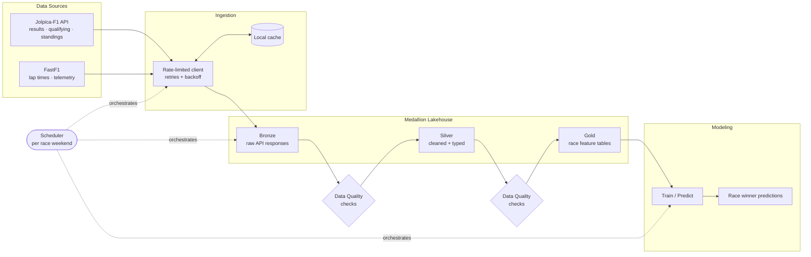

# F1 Race Winner Predictor — Data Pipeline

> An end-to-end data engineering pipeline that ingests Formula 1 data, processes it through
> a medallion (bronze → silver → gold) lakehouse architecture, and serves race-ready feature
> tables to a classification model that predicts race winners.

<!-- Optional badges — uncomment and fill in once you have a repo + CI set up.


-->

---

## Overview

This project is built **data-engineering-first**: the machine learning model is the final
consumer of the pipeline, not the point of it. The focus is on building a reliable, scheduled,
and well-tested data platform — ingestion under real API constraints, a layered lakehouse,
data quality gates, and orchestration — with the predictive model sitting on top of the gold layer.

**What it does:**
- Ingests historical and current-season F1 data (race results, qualifying, standings, lap times)
- Handles real ingestion constraints: API rate limits, retries with backoff, and local caching
- Processes data through bronze → silver → gold layers using PySpark / Delta Lake
- Validates data quality at each layer before promotion
- Runs on a schedule (after each race weekend) via an orchestrator
- Trains and serves a classification model to predict the next race winner

> _[Replace this section with a 2–3 sentence summary in your own voice once the project is running.
> Mention your headline result — e.g., pipeline runtime, number of seasons ingested, model accuracy —
> but keep the emphasis on the engineering.]_

---

## Architecture



---

## Tech stack

| Layer            | Tools |
|------------------|-------|
| Ingestion        | Python, `requests`, FastF1, Jolpica-F1 API |
| Processing       | PySpark, Delta Lake |
| Orchestration    | Databricks Workflows _(or Apache Airflow — pick one and note it here)_ |
| Data quality     | Great Expectations _(or custom assertion checks)_ |
| Storage          | Delta Lake / Parquet |
| Modeling         | scikit-learn |
| Compute          | Databricks Free Edition _(local Spark also works)_ |

> _[Trim this to the stack you actually use. Every tool here is a keyword recruiters and ATS scan for —
> only list what's truly in the repo, but don't leave true things off.]_

---

## Repository structure

```
f1-race-predictor/
├── README.md
├── requirements.txt
├── .gitignore
├── config/
│   └── config.yaml            # API base URL, rate limits, paths, seasons to ingest
├── src/
│   ├── ingestion/
│   │   ├── jolpica_client.py  # API client: rate limiting, retries, caching
│   │   └── fastf1_loader.py   # lap times / telemetry via FastF1
│   ├── transform/
│   │   ├── bronze.py          # land raw API responses
│   │   ├── silver.py          # clean, normalize, enforce schema/types
│   │   └── gold.py            # build race-ready feature tables
│   ├── quality/
│   │   └── checks.py          # data validation gates between layers
│   ├── modeling/
│   │   ├── train.py           # train the classifier on the gold layer
│   │   └── predict.py         # predict the next race winner
│   └── utils/
│       └── cache.py           # caching helpers for the ingestion layer
├── pipelines/
│   └── weekly_pipeline.py     # orchestration entry point (DAG / Databricks job)
├── notebooks/
│   └── exploration.ipynb      # EDA (optional)
├── tests/
│   └── test_ingestion.py      # unit tests — start with the client
└── data/                      # gitignored; bronze/silver/gold land here locally
    ├── bronze/
    ├── silver/
    └── gold/
```

---

## Data sources

- **[Jolpica-F1 API](https://github.com/jolpica/jolpica-f1)** — the actively maintained,
  drop-in successor to the original Ergast API (which was shut down at the start of 2025).
  Provides historical results, qualifying, standings, and constructor data back to 1950.
  Base URL: `https://api.jolpi.ca/ergast/f1`.
  **Note:** Jolpica is rate-limited (roughly 200 requests/hour), which directly shapes the
  ingestion design below.
- **[FastF1](https://docs.fastf1.dev/)** — Python library for detailed lap timing and
  telemetry; now pulls historical data from Jolpica under the hood.

---

## Pipeline stages (medallion)

**Bronze — raw landing.** Persist API responses exactly as received (plus an ingestion
timestamp and source metadata). No transformation. This makes every downstream run reproducible
and lets you re-derive silver/gold without re-hitting the rate-limited API.

**Silver — cleaned & typed.** Flatten nested JSON, enforce a schema, cast types, standardize
driver/constructor/circuit identifiers, deduplicate, and handle nulls. The trustworthy,
query-ready layer.

**Gold — features for modeling.** Aggregate and engineer race-level features (recent form,
qualifying position, constructor performance, circuit history, etc.) into the table the model
trains and predicts on.

---

## Data quality

Validation runs **between layers** — bad data should never get promoted:
- Row-count and freshness checks (did the latest race actually land?)
- Schema and type enforcement on the silver layer
- Range / null / uniqueness assertions on key columns
- Referential checks (every result maps to a known driver and circuit)

> _[Note which tool you used — Great Expectations, pandera, or plain assertions — and what happens
> when a check fails (fail the run vs. quarantine the batch).]_

---

## Setup

```bash
# 1. Clone
git clone https://github.com/<your-username>/f1-race-predictor.git
cd f1-race-predictor

# 2. Create and activate a virtual environment
python -m venv .venv
source .venv/bin/activate        # Windows: .venv\Scripts\activate

# 3. Install dependencies
pip install -r requirements.txt
```

---

## Usage

```bash
# Run the full pipeline (ingest -> bronze -> silver -> gold -> predict)
python pipelines/weekly_pipeline.py

# Or run a single stage
python -m src.ingestion.jolpica_client --season current
python -m src.transform.silver
python -m src.modeling.predict --next-race
```

> _[Update these commands to match how your code actually runs once it's built out.]_

---

## Engineering decisions

_This is the section that gets you the interview — explain the **why** behind the build, not just the what._

- **Rate limiting & caching.** Jolpica caps requests per hour, so the client enforces a
  request budget, retries with exponential backoff on failures, and caches raw responses
  locally — incremental runs only fetch new races instead of re-pulling history.
- **Bronze keeps raw data immutable.** Storing untouched API responses makes the pipeline
  reproducible and lets silver/gold be rebuilt without re-hitting the API.
- **Idempotent, incremental loads.** Re-running the pipeline for a given season/round
  produces the same result and only processes what changed.
- **Quality gates between layers.** Validation runs before each promotion so a bad upstream
  batch can't silently corrupt downstream tables.
- **The model is a consumer, not the core.** Swapping the classifier doesn't change the
  pipeline — the gold layer is a stable contract.

> _[Add or adjust these as you make real decisions. Honest trade-offs ("I chose X over Y because...")
> read as senior-level thinking.]_

---

## Roadmap

- [ ] Backfill all seasons from 1950 into bronze
- [ ] Add telemetry-based features from FastF1
- [ ] Stand up CI (lint + tests) with GitHub Actions
- [ ] Schedule the pipeline on Databricks Workflows
- [ ] Add model evaluation tracking (e.g., MLflow)

---

## Deployment (Databricks)

This project deploys to Databricks as a scheduled `bronze -> silver -> gold` Job,
defined as code in [`databricks.yml`](databricks.yml) (a Declarative Automation
Bundle). GitHub Actions run the tests and deploy the bundle automatically on every
push. For step-by-step, beginner-friendly setup instructions — pushing to GitHub,
connecting Git, and deploying — see [`SETUP_DATABRICKS.md`](SETUP_DATABRICKS.md).

## License

Released under the MIT License — see [`LICENSE`](LICENSE).
